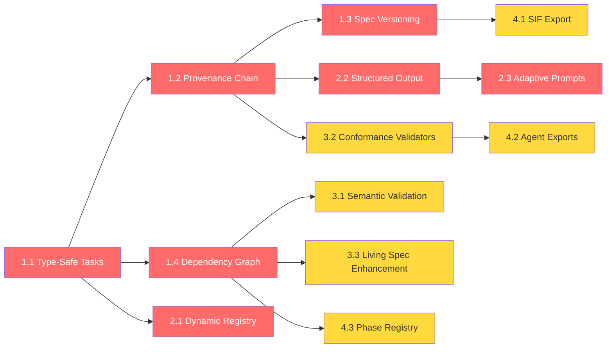

# SpecForge Architectural Roadmap

**Date:** February 28, 2026
**Version:** 1.0
**Status:** Approved — Ready for execution
**Origin:** Comprehensive Architectural Audit (EXA-powered industry research across 15+ specification engineering standards)

---

## Executive Summary

This roadmap transforms SpecForge from a **specification generator** into a **category-leading specification engineering platform**. It addresses 12 critical capability gaps identified across cross-model compatibility, specification validation, schema evolution, and interoperability — informed by industry benchmarks including MLSpec, MPLP v1.0, A2A Protocol, Open Agent Spec, PRISM, and Federated Schema Architectures.

**Four implementation tiers, 14 weeks total.**

---

## Tier 1: Foundation Integrity

> **Timeline:** Weeks 1–3 · **Priority:** 🔴 Critical · **Risk:** Low
>
> Prerequisites for all subsequent tiers. Eliminates structural weaknesses.

---

### 1.1 Type-Safe Generation Tasks

**Gap:** `generationTasks.plan` and `generationTasks.metadata` use `v.any()`, bypassing Convex's type system entirely. Runtime type errors are possible with no schema-level guarantees.

**Files to modify:**

- `convex/schema.ts` — Replace `v.any()` fields
- `convex/internalActions.ts` — Update type annotations for `plan` and `metadata` destructuring
- `convex/internal.ts` — Update mutation/query signatures
- `convex/projects.ts` — Update `startGeneration` coordinator

**Implementation:**

```typescript
// convex/schema.ts — generationTasks table

// Replace:
//   plan: v.any(),
//   metadata: v.any(),

// With:
plan: v.array(
  v.object({
    name: v.string(),
    maxTokens: v.number(),
    sectionType: v.optional(v.string()),
  })
),
metadata: v.object({
  model: v.object({
    id: v.string(),
    provider: v.string(),
    contextTokens: v.number(),
    maxOutputTokens: v.number(),
    defaultMax: v.number(),
    enabled: v.optional(v.boolean()),
  }),
  credentials: v.object({
    provider: v.string(),
    apiKey: v.string(),
    modelId: v.string(),
    zaiEndpointType: v.optional(
      v.union(v.literal('paid'), v.literal('coding'))
    ),
    zaiIsChina: v.optional(v.boolean()),
  }),
  artifactType: v.string(),
  projectContext: v.object({
    title: v.string(),
    description: v.string(),
    questions: v.string(),
  }),
  providerApiEndpoint: v.optional(v.string()),
  sectionPreferences: v.optional(
    v.array(
      v.object({
        sectionId: v.string(),
        enabled: v.boolean(),
        customInstructions: v.optional(v.string()),
      })
    )
  ),
}),
```

**Cascade changes:**

1. Update `internalActions.ts` `generatePhaseWorker` — destructure `metadata` with explicit interface instead of `any`
2. Update `projects.ts` `startPhaseGeneration` — ensure the coordinator creates tasks matching the new schema
3. Update `internal.ts` `createGenerationTask` mutation — use typed args instead of `v.any()`

**Acceptance criteria:**

- [ ] Zero `v.any()` references in `generationTasks` table definition
- [ ] All existing generation workflows pass with typed payloads
- [ ] TypeScript compilation passes with no `any` escape hatches in task-related code
- [ ] Existing tests in `convex/__tests__/` pass without modification

---

### 1.2 Artifact Provenance Chain

**Gap:** Artifacts track only `sections[].model` and `streamStatus`. No audit trail for prompt version, constitution version, temperature, or content hash. Cannot reproduce or audit how a specific artifact was generated.

**Files to modify:**

- `convex/schema.ts` — Add `provenance` field to `artifacts` table
- `convex/internal.ts` — Populate provenance during `createArtifact` and `appendSectionMetadataToArtifactInternal`
- `convex/internalActions.ts` — Compute provenance data in `generatePhaseWorker`
- `lib/llm/provenance.ts` — **[NEW]** Provenance computation utilities

**Implementation:**

```typescript
// convex/schema.ts — Add to artifacts table
provenance: v.optional(
  v.object({
    constitutionHash: v.optional(v.string()),
    modelId: v.string(),
    modelProvider: v.string(),
    promptHash: v.string(),
    temperature: v.number(),
    generatedAt: v.number(),
    specforgeVersion: v.string(),
    parentArtifactIds: v.optional(v.array(v.id('artifacts'))),
  })
),
```

```typescript
// lib/llm/provenance.ts — [NEW FILE]
import { createHash } from 'crypto';

export const SPECFORGE_VERSION = '2.0.0';

export function computeContentHash(content: string): string {
  return createHash('sha256').update(content).digest('hex').slice(0, 16);
}

export function computePromptHash(
  systemPrompt: string,
  userPrompt: string,
): string {
  const combined = `${systemPrompt}\n---\n${userPrompt}`;
  return createHash('sha256').update(combined).digest('hex').slice(0, 16);
}

export interface ProvenanceData {
  constitutionHash?: string;
  modelId: string;
  modelProvider: string;
  promptHash: string;
  temperature: number;
  generatedAt: number;
  specforgeVersion: string;
  parentArtifactIds?: string[];
}

export function buildProvenance(params: {
  modelId: string;
  modelProvider: string;
  systemPrompt: string;
  userPrompt: string;
  temperature: number;
  constitutionContent?: string;
  parentArtifactIds?: string[];
}): ProvenanceData {
  return {
    constitutionHash: params.constitutionContent
      ? computeContentHash(params.constitutionContent)
      : undefined,
    modelId: params.modelId,
    modelProvider: params.modelProvider,
    promptHash: computePromptHash(params.systemPrompt, params.userPrompt),
    temperature: params.temperature,
    generatedAt: Date.now(),
    specforgeVersion: SPECFORGE_VERSION,
    parentArtifactIds: params.parentArtifactIds,
  };
}
```

**Integration points:**

1. `generatePhaseWorker` — After building prompts via `buildTransformedPrompts()`, call `buildProvenance()` and pass result into `createArtifact` / `appendSectionMetadataToArtifactInternal`
2. `generateConstitution` — Compute self-provenance (no parent artifacts)
3. All phase generators — Include the constitution artifact ID in `parentArtifactIds`

**Acceptance criteria:**

- [ ] Every newly generated artifact has a non-null `provenance` field
- [ ] `provenance.promptHash` is deterministic (same prompt → same hash)
- [ ] `provenance.constitutionHash` links to the exact constitution version used
- [ ] Existing artifacts with `provenance: undefined` continue to function (optional field)
- [ ] Unit tests verify hash computation determinism

---

### 1.3 Specification Versioning System

**Gap:** Artifacts are overwritten in-place. No version history, diff tracking, or rollback. Users cannot compare how specs evolved.

**Files to modify:**

- `convex/schema.ts` — Add `artifactVersions` table
- `convex/internal.ts` — Add versioning mutations
- `convex/artifacts.ts` — Add version querying endpoints
- `lib/llm/provenance.ts` — Content hashing (from 1.2)

**Implementation:**

```typescript
// convex/schema.ts — New table
artifactVersions: defineTable({
  artifactId: v.id('artifacts'),
  version: v.number(),
  content: v.string(),
  contentHash: v.string(),
  previewHtml: v.string(),
  provenance: v.optional(
    v.object({
      constitutionHash: v.optional(v.string()),
      modelId: v.string(),
      modelProvider: v.string(),
      promptHash: v.string(),
      temperature: v.number(),
      generatedAt: v.number(),
      specforgeVersion: v.string(),
      parentArtifactIds: v.optional(v.array(v.id('artifacts'))),
    })
  ),
  createdAt: v.number(),
  createdBy: v.union(v.literal('system'), v.literal('user')),
  changeReason: v.optional(v.string()),
})
  .index('by_artifact', ['artifactId'])
  .index('by_artifact_version', ['artifactId', 'version']),
```

```typescript
// convex/internal.ts — New mutations

// Snapshot current artifact state before overwriting
export const snapshotArtifactVersion = internalMutation({
  args: {
    artifactId: v.id('artifacts'),
    changeReason: v.optional(v.string()),
  },
  handler: async (ctx, args) => {
    const artifact = await ctx.db.get(args.artifactId);
    if (!artifact) return;

    // Get current max version
    const latestVersion = await ctx.db
      .query('artifactVersions')
      .withIndex('by_artifact', (q) => q.eq('artifactId', args.artifactId))
      .order('desc')
      .first();

    const nextVersion = (latestVersion?.version ?? 0) + 1;

    await ctx.db.insert('artifactVersions', {
      artifactId: args.artifactId,
      version: nextVersion,
      content: artifact.content,
      contentHash: computeContentHash(artifact.content),
      previewHtml: artifact.previewHtml,
      provenance: artifact.provenance,
      createdAt: Date.now(),
      createdBy: 'system',
      changeReason: args.changeReason,
    });

    return nextVersion;
  },
});
```

```typescript
// convex/artifacts.ts — New queries

export const getArtifactVersions = query({
  args: { artifactId: v.id('artifacts') },
  handler: async (ctx, args) => {
    return await ctx.db
      .query('artifactVersions')
      .withIndex('by_artifact', (q) => q.eq('artifactId', args.artifactId))
      .order('desc')
      .collect();
  },
});

export const getArtifactVersion = query({
  args: {
    artifactId: v.id('artifacts'),
    version: v.number(),
  },
  handler: async (ctx, args) => {
    return await ctx.db
      .query('artifactVersions')
      .withIndex('by_artifact_version', (q) =>
        q.eq('artifactId', args.artifactId).eq('version', args.version),
      )
      .first();
  },
});
```

**Storage management:** Implement a retention policy (keep last 10 versions per artifact) via a scheduled Convex action that runs weekly. Prevents unbounded storage growth within Convex free-tier limits.

**Acceptance criteria:**

- [ ] `artifactVersions` table created and indexed
- [ ] Every artifact re-generation creates a snapshot of the previous version
- [ ] Version list query returns versions in descending order
- [ ] Single version retrieval works by `(artifactId, version)` pair
- [ ] Retention policy scheduled action exists and cleans old versions
- [ ] Storage impact documented (estimated bytes per version)

---

### 1.4 Phase Dependency Graph

**Gap:** Phase ordering is fully implicit — hardcoded in the UI. No formal graph of dependencies between phases/artifacts. Cannot detect when a Constitution change should trigger downstream re-generation.

**Files to modify:**

- `lib/specification/dependency-graph.ts` — **[NEW]** Dependency DAG
- `convex/internal.ts` — Add staleness detection mutation
- `convex/projects.ts` — Use dependency graph for phase status

**Implementation:**

```typescript
// lib/specification/dependency-graph.ts — [NEW FILE]

export const PHASE_DEPENDENCIES: Record<string, string[]> = {
  constitution: [],
  brief: [],
  prd: ['brief', 'constitution'],
  domainModel: ['brief', 'constitution'],
  specs: ['prd', 'domainModel', 'constitution'],
  stories: ['specs', 'prd', 'constitution'],
  artifacts: ['specs', 'stories'],
  handoff: ['specs', 'stories', 'artifacts', 'constitution'],
};

/**
 * Returns all phases that depend (directly or transitively) on the changed phase.
 * Used to mark downstream phases as "stale" when an upstream phase is re-generated.
 */
export function getAffectedPhases(changedPhase: string): string[] {
  const affected = new Set<string>();

  function collect(phase: string): void {
    for (const [downstream, deps] of Object.entries(PHASE_DEPENDENCIES)) {
      if (deps.includes(phase) && !affected.has(downstream)) {
        affected.add(downstream);
        collect(downstream); // Transitive propagation
      }
    }
  }

  collect(changedPhase);
  return Array.from(affected);
}

/**
 * Validates that a phase can be generated by checking all dependencies are "ready".
 */
export function canGeneratePhase(
  phaseId: string,
  phaseStatuses: Record<string, string>,
): { canGenerate: boolean; blockedBy: string[] } {
  const deps = PHASE_DEPENDENCIES[phaseId] || [];
  const blockedBy = deps.filter((dep) => phaseStatuses[dep] !== 'ready');
  return {
    canGenerate: blockedBy.length === 0,
    blockedBy,
  };
}

/**
 * Returns the topological order of phases for sequential generation.
 */
export function getPhaseOrder(): string[] {
  return [
    'constitution',
    'brief',
    'prd',
    'domainModel',
    'specs',
    'stories',
    'artifacts',
    'handoff',
  ];
}

/**
 * Returns required upstream artifacts for a given phase's prompt context.
 */
export function getRequiredContext(phaseId: string): string[] {
  return PHASE_DEPENDENCIES[phaseId] || [];
}
```

**Integration:**

1. When a phase is re-generated, call `getAffectedPhases(phaseId)` and set those downstream phases to a new `stale` status (or display a UI warning)
2. Before generating a phase, call `canGeneratePhase()` and block if dependencies aren't ready
3. Use `getRequiredContext()` to automatically fetch upstream artifacts for prompt injection

**Acceptance criteria:**

- [ ] Dependency graph is acyclic (unit test validates no cycles)
- [ ] `getAffectedPhases('constitution')` returns all 6 downstream phases
- [ ] `canGeneratePhase('specs', { brief: 'ready', prd: 'pending', ... })` correctly blocks
- [ ] Phase re-generation marks downstream phases as stale in the UI
- [ ] Unit tests cover all graph traversal edge cases

---

## Tier 2: Model Agnosticism

> **Timeline:** Weeks 4–6 · **Priority:** 🔴 Critical · **Risk:** Medium
>
> Ensures SpecForge can absorb new models without code changes and maximizes output quality across all providers.

---

### 2.1 Dynamic Model Registry

**Gap:** `MODEL_REGISTRY` in `registry.ts` is a static array of 18 hardcoded models. Adding any new model requires a code change and deployment.

**Files to modify:**

- `lib/llm/registry.ts` — Refactor to DB-first resolution with hardcoded fallback
- `convex/schema.ts` — Add `modelDirectoryCache` table (optional)
- `convex/llmModels.ts` — Add admin model management mutations
- `convex/internalActions.ts` — Add scheduled cache refresh from models.dev API

**Implementation:**

```typescript
// lib/llm/registry.ts — Refactored resolution chain

/**
 * Model resolution priority:
 * 1. Database (llmModels table) — admin-managed, always authoritative
 * 2. models.dev API cache — auto-refreshed daily
 * 3. Hardcoded FALLBACK_REGISTRY — last resort for bootstrapping
 */
export async function resolveModel(
  modelId: string,
  dbModels?: Array<{
    provider: string;
    modelId: string;
    contextTokens: number;
    maxOutputTokens: number;
    defaultMax: number;
    enabled: boolean;
  }>,
): Promise<LlmModel | null> {
  // 1. DB lookup (admin-managed)
  if (dbModels) {
    const dbModel = dbModels.find((m) => m.modelId === modelId && m.enabled);
    if (dbModel) return toLlmModel(dbModel);
  }

  // 2. Hardcoded fallback (renamed from MODEL_REGISTRY)
  const fallback = FALLBACK_REGISTRY.find((e) => e.model.id === modelId);
  if (fallback) return fallback.model;

  return null;
}

// Rename existing MODEL_REGISTRY → FALLBACK_REGISTRY (internal only)
const FALLBACK_REGISTRY: RegistryEntry[] = [
  // ...existing 18 entries unchanged...
];

// Keep getModelById as a sync wrapper for backward compatibility
export function getModelById(
  modelId: string,
  dbModels?: Array<{
    provider: string;
    modelId: string;
    contextTokens: number;
    maxOutputTokens: number;
    defaultMax: number;
  }>,
): LlmModel | null {
  // Sync path — check fallback registry + dbModels
  if (dbModels) {
    const dbModel = dbModels.find((m) => m.modelId === modelId);
    if (dbModel) {
      return {
        id: dbModel.modelId,
        provider: dbModel.provider,
        contextTokens: dbModel.contextTokens,
        maxOutputTokens: dbModel.maxOutputTokens,
        defaultMax: dbModel.defaultMax,
        enabled: true,
      };
    }
  }

  const entry = FALLBACK_REGISTRY.find((e) => e.model.id === modelId);
  return entry?.model ?? null;
}
```

**Admin interface:** Extend the existing admin dashboard (`/admin`) with a Model Management panel that allows adding/editing/disabling models directly in the `llmModels` table, bypassing the hardcoded registry entirely.

**Acceptance criteria:**

- [ ] `llmModels` DB entries take priority over hardcoded fallback
- [ ] Removing a model from `FALLBACK_REGISTRY` has no effect if it exists in DB
- [ ] Admin can add a new model via dashboard without code deployment
- [ ] All existing model resolution paths continue working
- [ ] `getModelById` backward compatibility maintained (sync signature unchanged)

---

### 2.2 Structured Output Modes

**Gap:** Constitution JSON extracted via regex (`/```(?:json)?\s*([\s\S]*?)\s*```/`) then Zod-validated. No constrained decoding or provider-native schema enforcement.

**Files to modify:**

- `lib/llm/structured-output.ts` — **[NEW]** Provider-aware structured output config
- `lib/llm/providers/openai.ts` — Add `response_format` support
- `lib/llm/providers/anthropic.ts` — Add tool-use structured extraction
- `convex/actions/generatePhase.ts` → `generateConstitution()` — Use structured output when available
- `lib/llm/types.ts` — Extend `LlmProvider` interface

**Implementation:**

```typescript
// lib/llm/structured-output.ts — [NEW FILE]

import type { ZodSchema } from 'zod';

export type StructuredOutputMode =
  | { type: 'json_schema'; schema: object } // OpenAI native
  | { type: 'tool_use'; toolName: string; schema: object } // Anthropic
  | { type: 'json_object' } // Weak JSON mode
  | { type: 'none' }; // Regex fallback

/**
 * Returns the best structured output mode for a given provider.
 * Falls back gracefully: native schema → json_object → regex.
 */
export function getStructuredOutputMode(
  provider: string,
  jsonSchema: object,
): StructuredOutputMode {
  switch (provider) {
    case 'openai':
      return {
        type: 'json_schema',
        schema: jsonSchema,
      };
    case 'anthropic':
      return {
        type: 'tool_use',
        toolName: 'extract_structured_data',
        schema: jsonSchema,
      };
    case 'deepseek':
    case 'mistral':
      return { type: 'json_object' };
    default:
      return { type: 'none' };
  }
}

/**
 * Applies structured output parameters to a request body.
 */
export function applyStructuredOutput(
  requestBody: Record<string, unknown>,
  mode: StructuredOutputMode,
): Record<string, unknown> {
  switch (mode.type) {
    case 'json_schema':
      return {
        ...requestBody,
        response_format: {
          type: 'json_schema',
          json_schema: {
            name: 'structured_output',
            strict: true,
            schema: mode.schema,
          },
        },
      };
    case 'tool_use':
      return {
        ...requestBody,
        tools: [
          {
            name: mode.toolName,
            description: 'Extract structured data from the content',
            input_schema: mode.schema,
          },
        ],
        tool_choice: { type: 'tool', name: mode.toolName },
      };
    case 'json_object':
      return {
        ...requestBody,
        response_format: { type: 'json_object' },
      };
    default:
      return requestBody;
  }
}
```

**Integration into Constitution generation:**

1. In `generateConstitution()`, convert `ConstitutionSchema` to JSON Schema via `zod-to-json-schema`
2. Call `getStructuredOutputMode(provider, jsonSchema)` to get the best mode
3. Pass mode into the LLM call via `applyStructuredOutput()`
4. If mode is `none`, fall back to current regex + Zod validation

**Acceptance criteria:**

- [ ] OpenAI models use native `json_schema` response format for Constitution
- [ ] Anthropic models use `tool_use` for structured Constitution extraction
- [ ] DeepSeek/Mistral use `json_object` mode
- [ ] Unknown providers fall back to regex extraction (no regression)
- [ ] Constitution generation failure rate decreases measurably
- [ ] `zod-to-json-schema` added as dependency

---

### 2.3 Adaptive Prompt Transformer

**Gap:** `prompt-transformer.ts` has only 3 branches: Anthropic, DeepSeek+Minimax, and generic. Z.AI GLM models (which support unique prompting features) and OpenRouter (which proxies to various models) both fall through to the generic branch.

**Files to modify:**

- `lib/llm/prompt-transformer.ts` — Refactor to capability-based system
- `lib/llm/provider-capabilities.ts` — **[NEW]** Provider capability registry

**Implementation:**

```typescript
// lib/llm/provider-capabilities.ts — [NEW FILE]

export interface PromptCapabilities {
  supportsXmlTags: boolean;
  supportsSystemRole: boolean;
  prefersMarkdownStructure: boolean;
  supportsChainOfThought: boolean;
  contextFormat: 'xml' | 'markdown' | 'plaintext';
  maxSystemPromptTokens: number;
}

export const PROVIDER_CAPABILITIES: Record<string, PromptCapabilities> = {
  anthropic: {
    supportsXmlTags: true,
    supportsSystemRole: true,
    prefersMarkdownStructure: false,
    supportsChainOfThought: true,
    contextFormat: 'xml',
    maxSystemPromptTokens: 4096,
  },
  openai: {
    supportsXmlTags: false,
    supportsSystemRole: true,
    prefersMarkdownStructure: true,
    supportsChainOfThought: true,
    contextFormat: 'markdown',
    maxSystemPromptTokens: 8192,
  },
  zai: {
    supportsXmlTags: false,
    supportsSystemRole: true,
    prefersMarkdownStructure: true,
    supportsChainOfThought: true,
    contextFormat: 'markdown',
    maxSystemPromptTokens: 4096,
  },
  deepseek: {
    supportsXmlTags: false,
    supportsSystemRole: true,
    prefersMarkdownStructure: true,
    supportsChainOfThought: true,
    contextFormat: 'markdown',
    maxSystemPromptTokens: 4096,
  },
  minimax: {
    supportsXmlTags: false,
    supportsSystemRole: true,
    prefersMarkdownStructure: true,
    supportsChainOfThought: false,
    contextFormat: 'markdown',
    maxSystemPromptTokens: 4096,
  },
  mistral: {
    supportsXmlTags: false,
    supportsSystemRole: true,
    prefersMarkdownStructure: true,
    supportsChainOfThought: true,
    contextFormat: 'markdown',
    maxSystemPromptTokens: 4096,
  },
  openrouter: {
    supportsXmlTags: false,
    supportsSystemRole: true,
    prefersMarkdownStructure: true,
    supportsChainOfThought: true,
    contextFormat: 'markdown',
    maxSystemPromptTokens: 4096,
  },
};

export function getCapabilities(provider: string): PromptCapabilities {
  return PROVIDER_CAPABILITIES[provider] ?? PROVIDER_CAPABILITIES.openai;
}
```

**Refactored `prompt-transformer.ts`:**
Replace the `isAnthropic` / `isDeepSeek || isMinimax` branching with capability checks:

- `caps.contextFormat === 'xml'` → Use XML tags
- `caps.prefersMarkdownStructure` → Use Markdown headers
- `caps.supportsChainOfThought` → Include CoT directives

**Acceptance criteria:**

- [ ] No provider name string comparisons in prompt building logic
- [ ] Adding a new provider requires only a `PROVIDER_CAPABILITIES` entry
- [ ] Existing prompt quality does not regress (compare outputs manually)
- [ ] OpenRouter automatically inherits reasonable defaults
- [ ] Unit tests verify capability-based branching for all 7 providers

---

## Tier 3: Validation & Consistency

> **Timeline:** Weeks 7–10 · **Priority:** 🟡 High · **Risk:** Medium
>
> Strengthens specification quality through semantic validation and cross-artifact consistency checking.

---

### 3.1 Semantic Constitution Validation

**Gap:** `constitution-schema.ts` validates structural shape only. A Constitution could declare "Microservices architecture" with "SQLite database" — logically contradictory but structurally valid.

**Files to modify:**

- `lib/validation/semantic-validator.ts` — **[NEW]** Rule-based semantic checks
- `convex/actions/generatePhase.ts` — Integrate semantic validation after Zod parse
- `convex/internalActions.ts` — Report validation warnings in generation logs

**Implementation:**

```typescript
// lib/validation/semantic-validator.ts — [NEW FILE]

import type { ProjectConstitution } from './constitution-schema';

export interface SemanticWarning {
  ruleId: string;
  severity: 'error' | 'warning';
  message: string;
  field: string;
  suggestion: string;
}

interface SemanticRule {
  id: string;
  description: string;
  check: (constitution: ProjectConstitution) => SemanticWarning | null;
}

const SEMANTIC_RULES: SemanticRule[] = [
  {
    id: 'arch-db-alignment',
    description: 'Architecture pattern should align with database choice',
    check: (c) => {
      const arch = c.architecture.pattern.toLowerCase();
      const db = c.techStack.database.type.toLowerCase();
      if (arch.includes('microservice') && db.includes('sqlite')) {
        return {
          ruleId: 'arch-db-alignment',
          severity: 'error',
          message: 'Microservices architecture with SQLite is contradictory',
          field: 'techStack.database.type',
          suggestion: 'Use PostgreSQL, MongoDB, or a distributed database',
        };
      }
      return null;
    },
  },
  {
    id: 'performance-ssr-alignment',
    description: 'Performance targets should be achievable with stated stack',
    check: (c) => {
      const ttfb = c.qualityStandards.performance.ttfbTarget;
      const isSPA = c.architecture.pattern.toLowerCase().includes('spa');
      if (ttfb.includes('100ms') && isSPA) {
        return {
          ruleId: 'performance-ssr-alignment',
          severity: 'warning',
          message: '<100ms TTFB is difficult to achieve with a pure SPA',
          field: 'qualityStandards.performance.ttfbTarget',
          suggestion: 'Consider SSR/SSG or increase TTFB target to <200ms',
        };
      }
      return null;
    },
  },
  {
    id: 'security-auth-completeness',
    description: 'Security requirements should include auth details',
    check: (c) => {
      const auth = c.qualityStandards.security.authentication;
      if (!auth || auth === 'none' || auth === 'N/A') {
        return {
          ruleId: 'security-auth-completeness',
          severity: 'warning',
          message: 'No authentication strategy defined',
          field: 'qualityStandards.security.authentication',
          suggestion:
            'Specify auth method: JWT, OAuth 2.0, Session-based, etc.',
        };
      }
      return null;
    },
  },
  {
    id: 'forbidden-stack-conflict',
    description: 'Forbidden patterns should not conflict with tech stack',
    check: (c) => {
      const stack = JSON.stringify(c.techStack).toLowerCase();
      for (const fp of c.forbiddenPatterns) {
        const pattern = fp.pattern.toLowerCase();
        if (stack.includes(pattern)) {
          return {
            ruleId: 'forbidden-stack-conflict',
            severity: 'error',
            message: `Forbidden pattern "${fp.pattern}" appears in tech stack`,
            field: 'forbiddenPatterns',
            suggestion: `Remove "${fp.pattern}" from forbidden list or change tech stack`,
          };
        }
      }
      return null;
    },
  },
];

export function validateSemantics(
  constitution: ProjectConstitution,
): SemanticWarning[] {
  return SEMANTIC_RULES.map((rule) => rule.check(constitution)).filter(
    (w): w is SemanticWarning => w !== null,
  );
}

export function hasBlockingErrors(warnings: SemanticWarning[]): boolean {
  return warnings.some((w) => w.severity === 'error');
}
```

**Acceptance criteria:**

- [ ] Semantic validation runs after Zod structural validation
- [ ] Errors block Constitution finalization; warnings are logged but non-blocking
- [ ] At least 4 semantic rules implemented (arch-db, performance-ssr, security-auth, forbidden-conflict)
- [ ] Warnings are surfaced in generation logs for debugging
- [ ] Rules are extensible — adding a new rule requires only a `SEMANTIC_RULES` array entry

---

### 3.2 Specification Conformance Validators

**Gap:** No automated check that generated artifacts actually meet the standards they claim (e.g., WCAG compliance, valid OpenAPI, etc.).

**Files to modify:**

- `lib/validation/conformance/` — **[NEW]** Validator modules
- `convex/actions/generatePhase.ts` — Run conformance checks post-generation

**Implementation:**

```
lib/validation/conformance/
├── index.ts                  — Validator registry and runner
├── completeness-checker.ts   — Validates all required sections are non-empty
├── api-schema-validator.ts   — Validates API spec sections contain valid endpoint definitions
└── security-coverage.ts      — Validates OWASP Top 10 coverage in security sections
```

```typescript
// lib/validation/conformance/index.ts

export interface ConformanceResult {
  validatorId: string;
  passed: boolean;
  score: number; // 0-100
  issues: string[];
}

export interface ConformanceValidator {
  id: string;
  appliesToPhases: string[];
  validate: (
    content: string,
    constitution?: ProjectConstitution,
  ) => ConformanceResult;
}

const VALIDATORS: ConformanceValidator[] = [];

export function registerValidator(v: ConformanceValidator): void {
  VALIDATORS.push(v);
}

export function runConformanceChecks(
  content: string,
  phaseId: string,
  constitution?: ProjectConstitution,
): ConformanceResult[] {
  return VALIDATORS.filter((v) => v.appliesToPhases.includes(phaseId)).map(
    (v) => v.validate(content, constitution),
  );
}
```

**Acceptance criteria:**

- [ ] Completeness checker verifies all section headers from the section plan are present in output
- [ ] API schema validator checks for endpoint definitions in specs phase
- [ ] Security coverage validator checks for OWASP categories in security sections
- [ ] Conformance results are stored alongside the artifact (optional field on `artifacts` table)
- [ ] Validators are pluggable — registration pattern via `registerValidator()`

---

### 3.3 Living Spec Enhancement

**Gap:** Current PRD drift detection (`detectPrdDrift`) runs only at the Handoff phase. Should run after every phase to catch drift early.

**Files to modify:**

- `convex/internalActions.ts` — Extend drift detection to all phases after `prd`
- `convex/schema.ts` — Add `driftReport` field to phases table

**Implementation:**

Add `driftDetected` and `driftReport` optional fields to the `phases` table. After each post-PRD phase completes, run a lightweight drift check against the constitution. If drift exceeds a threshold, set `driftDetected: true` and store the report for UI display.

**Acceptance criteria:**

- [ ] Drift detection runs after every phase completion (not just Handoff)
- [ ] Drift report is stored per-phase for UI display
- [ ] UI shows a warning badge on phases with detected drift
- [ ] Users can dismiss drift warnings
- [ ] Drift check is skippable via feature flag to control LLM costs

---

## Tier 4: Interoperability & Standards

> **Timeline:** Weeks 11–14 · **Priority:** 🟡 High · **Risk:** Low
>
> Positions SpecForge as a standards-compliant platform with machine-readable outputs.

---

### 4.1 SpecForge Interchange Format (SIF)

**Gap:** Export is Markdown + ZIP only. Artifacts are opaque to external tooling, CI/CD pipelines, and code generators.

**Files to modify:**

- `lib/export/sif-schema.ts` — **[NEW]** SIF JSON Schema definition
- `lib/export/sif-exporter.ts` — **[NEW]** Export logic
- `convex/artifacts.ts` — Add SIF export query
- `lib/zip.ts` — Include SIF in ZIP exports

**SIF v1 Schema:**

```typescript
// lib/export/sif-schema.ts — [NEW FILE]

export interface SpecForgeInterchangeFormat {
  $schema: 'https://specforge.dev/schemas/sif/v1.json';
  version: '1.0.0';
  project: {
    title: string;
    description: string;
    createdAt: string; // ISO 8601
    updatedAt: string;
    specforgeVersion: string;
  };
  constitution?: ProjectConstitution;
  phases: Array<{
    id: string;
    name: string;
    status: string;
    artifacts: Array<{
      id: string;
      type: string;
      title: string;
      content: string;
      contentHash: string;
      provenance?: ProvenanceData;
      sections: Array<{ name: string; tokens: number; model: string }>;
    }>;
  }>;
  dependencyGraph: Record<string, string[]>;
  metadata: {
    exportedAt: string;
    exportedBy: string;
    conformanceLevel: 'L0' | 'L1' | 'L2';
  };
}
```

**Acceptance criteria:**

- [ ] SIF JSON validates against its own JSON Schema
- [ ] Export includes all non-hidden artifacts
- [ ] Constitution is included in parsed form (not raw Markdown)
- [ ] Dependency graph matches `PHASE_DEPENDENCIES`
- [ ] SIF file included in ZIP export alongside Markdown files
- [ ] Import endpoint can hydrate a project from SIF (stretch goal)

---

### 4.2 Enhanced Agent-Native Exports

**Gap:** SKILL.md and AGENTS.md exports are planned (2026 Implementation Plan Phase 3) but not yet implemented.

**Files to modify:**

- `lib/export/skill-formatter.ts` — **[NEW]** SKILL.md generator
- `lib/export/agents-formatter.ts` — **[NEW]** AGENTS.md generator
- `lib/zip.ts` — Include agent files in ZIP export

This implements the existing Phase 3 from `IMPLEMENTATION_PLAN_2026.md` with the following additions:

- Include `provenance` metadata in SKILL.md YAML frontmatter
- Include `dependencyGraph` for understanding phase relationships
- Add `conformanceLevel` indicator

**Acceptance criteria:**

- [ ] SKILL.md conforms to Anthropic/agentskills.io format
- [ ] YAML frontmatter includes: name, description, license, compatibility list
- [ ] AGENTS.md includes project context, conventions, and key files
- [ ] Both files included in ZIP export
- [ ] Export UI offers individual download for each format

---

### 4.3 Pluggable Phase Architecture

**Gap:** Adding or reordering phases requires changes across `section-plans.ts`, `internalActions.ts`, and UI components. Cannot customize the pipeline for different project types.

**Files to modify:**

- `lib/specification/phase-registry.ts` — **[NEW]** Declarative phase system
- `lib/llm/section-plans.ts` — Refactor to use phase registry
- `convex/projects.ts` — Use registry for phase initialization

**Implementation:**

```typescript
// lib/specification/phase-registry.ts — [NEW FILE]

export interface PhaseDefinition {
  id: string;
  name: string;
  description: string;
  artifactType: string;
  sections: SectionPlanConfig[];
  dependencies: string[];
  isRequired: boolean;
  isHidden: boolean;
  validators: string[]; // Validator IDs from conformance registry
}

const PHASE_REGISTRY = new Map<string, PhaseDefinition>();

// Register default phases
export function registerDefaultPhases(): void {
  registerPhase({
    id: 'constitution',
    name: 'Project Constitution',
    description: 'Immutable standards and constraints',
    artifactType: 'constitution',
    sections: CONSTITUTION_SECTIONS,
    dependencies: [],
    isRequired: true,
    isHidden: false,
    validators: ['semantic-constitution'],
  });
  // ...register all 8 default phases
}

export function registerPhase(def: PhaseDefinition): void {
  // Validate dependency chain is acyclic
  if (wouldCreateCycle(def)) {
    throw new Error(`Phase "${def.id}" would create a dependency cycle`);
  }
  PHASE_REGISTRY.set(def.id, def);
}

export function getPhaseDefinition(id: string): PhaseDefinition | undefined {
  return PHASE_REGISTRY.get(id);
}

export function getAllPhases(): PhaseDefinition[] {
  return Array.from(PHASE_REGISTRY.values());
}
```

**Acceptance criteria:**

- [ ] All 8 default phases registered via `registerDefaultPhases()`
- [ ] Phase definitions include all metadata needed for generation, validation, and UI rendering
- [ ] Cycle detection prevents invalid dependency graphs
- [ ] Section plans sourced from phase registry instead of standalone constants
- [ ] Adding a new phase type requires only a `registerPhase()` call + UI entry

---

## Verification Plan

### Automated Tests

```bash
# Tier 1 — Run after each change
npm run test                    # Existing test suite (no regressions)
npm run typecheck               # Zero TypeScript errors

# New test files to create:
# lib/__tests__/provenance.test.ts
# lib/__tests__/dependency-graph.test.ts
# lib/validation/__tests__/semantic-validator.test.ts
# lib/validation/__tests__/conformance.test.ts
# lib/export/__tests__/sif-exporter.test.ts
```

### Integration Verification

- [ ] Create a test project and run through all 8 phases with provenance tracking
- [ ] Verify `artifactVersions` table populates on re-generation
- [ ] Verify structured output mode activates for OpenAI provider (check request logs)
- [ ] Verify dependency graph correctly marks downstream phases stale
- [ ] Export SIF JSON and validate against schema
- [ ] Import SIF JSON and verify project hydration (Tier 4 stretch)

### Manual Verification

- [ ] Admin dashboard model management works for adding/editing/disabling models
- [ ] UI displays provenance metadata on artifact detail view
- [ ] Version history dropdown shows for artifacts with multiple versions
- [ ] Drift warning badge appears on phases with detected drift
- [ ] SKILL.md export opens correctly in Claude Code / Cursor

---

## Dependency Order



---

## Risk Mitigation

| Risk                                             | Probability | Mitigation                                                      |
| ------------------------------------------------ | ----------- | --------------------------------------------------------------- |
| Convex storage limits with versioned artifacts   | High        | Retention policy: keep last 10 versions per artifact            |
| Structured output unavailable for some providers | Medium      | Graceful fallback to regex + Zod (current behavior preserved)   |
| Schema migration breaking existing projects      | Medium      | All new fields use `v.optional()`, background migration actions |
| LLM cost increase from semantic validation       | Medium      | Validation is opt-in via feature flag, results are cached       |
| Phase registry complexity overwhelming users     | Low         | Default pipeline unchanged; customization via admin only        |

---

## New Dependencies

| Package              | Purpose                                                  | Tier   |
| -------------------- | -------------------------------------------------------- | ------ |
| `zod-to-json-schema` | Convert Zod schemas to JSON Schema for structured output | Tier 2 |

> [!NOTE]
> All other implementations use only existing dependencies (Zod, crypto, Convex primitives).

---

## Summary

| Tier                     | Items  | Timeline     | New Files  | Modified Files  |
| ------------------------ | ------ | ------------ | ---------- | --------------- |
| **1. Foundation**        | 4      | Weeks 1–3    | 2          | 6               |
| **2. Model Agnosticism** | 3      | Weeks 4–6    | 2          | 5               |
| **3. Validation**        | 3      | Weeks 7–10   | 3          | 4               |
| **4. Interoperability**  | 3      | Weeks 11–14  | 4          | 3               |
| **Total**                | **13** | **14 weeks** | **11 new** | **18 modified** |
